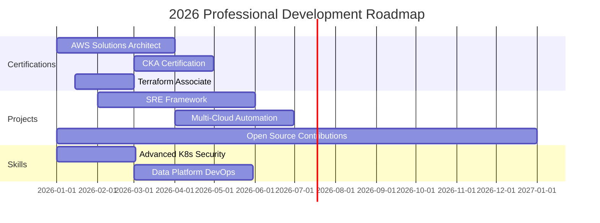

<div align="center">


[](https://git.io/typing-svg)


</div>

## 🎯 About Me

```yaml
name: Preetham Darshanala
located_in: Pune, India
current_workplace: Amdocs (AT&T Project)
role: DevOps Engineer

education:
  - B.Tech in Electronics & Communication Engineering
  - Birla Institute of Technology, Mesra (2019-2023)

fields_of_interest:
  - Cloud Native Architecture
  - Infrastructure Automation
  - Container Orchestration
  - DevSecOps & Site Reliability Engineering
  - Cost Optimization & FinOps

currently_learning:
  - Advanced Kubernetes Security & CKA Preparation
  - Data Platform DevOps (Kafka, ClickHouse, Redis)
  - AWS Solutions Architect
  - Terraform Advanced Patterns

2026_goals:
  - AWS Solutions Architect Associate Certification
  - Certified Kubernetes Administrator (CKA)
  - Contribute to 5+ Open Source DevOps Projects
  - Build Production-Grade SRE Framework
```


## 💼 Professional Highlights

<div align="center">

| 🎯 Achievement | 📊 Impact | 🏆 Recognition |
|:---|:---:|---:|
| **Deployment Optimization** | ⚡ 40% faster releases | 🚀 |
| **Cost Reduction** | 💰 $400K+ annual savings | 💎 |
| **Infrastructure Efficiency** | 📉 37% cost optimization | ⭐ |
| **System Reliability** | 🎯 99.9% uptime SLA | 🔥 |

</div>

**🏆 FinOps Success Story of the Month - Amdocs FY25**
> Led AT&T's Azure optimization initiative, achieving 37% cost reduction and $400K annualized savings through infrastructure automation, monitoring, and resource optimization


## 🛠️ Tech Arsenal

<div align="center">

### ☁️ Cloud & Infrastructure
[](https://aws.amazon.com/)
[](https://azure.microsoft.com/)
[](https://cloud.google.com/)
[](https://www.digitalocean.com/)

### 🐳 Container & Orchestration
[](https://kubernetes.io/)
[](https://www.docker.com/)
[](https://helm.sh/)
[](https://rancher.com/)

### 🔄 CI/CD & GitOps
[](https://www.jenkins.io/)
[](https://github.com/features/actions)
[](https://about.gitlab.com/)
[](https://argo-cd.readthedocs.io/)
[](https://circleci.com/)

### 🏗️ Infrastructure as Code
[](https://www.terraform.io/)
[](https://www.ansible.com/)
[](https://aws.amazon.com/cloudformation/)
[](https://www.pulumi.com/)

### 📊 Monitoring & Observability
[](https://prometheus.io/)
[](https://grafana.com/)
[](https://www.datadoghq.com/)
[](https://newrelic.com/)
[](https://www.elastic.co/elastic-stack)

### 💻 Languages & Scripting
[](https://www.python.org/)
[](https://www.gnu.org/software/bash/)
[](https://golang.org/)
[](https://docs.microsoft.com/en-us/powershell/)
[](https://yaml.org/)

### 🗄️ Databases & Caching
[](https://www.postgresql.org/)
[](https://www.mongodb.com/)
[](https://redis.io/)
[](https://www.mysql.com/)

### 🔐 Security & Compliance
[](https://www.vaultproject.io/)
[](https://www.sonarqube.org/)
[](https://trivy.dev/)

### 🛠️ Tools & Platforms
[](https://git-scm.com/)
[](https://github.com/)
[](https://gitlab.com/)
[](https://www.atlassian.com/software/jira)
[](https://slack.com/)

### 🖥️ Operating Systems
[](https://www.linux.org/)
[](https://ubuntu.com/)
[](https://www.centos.org/)
[](https://www.redhat.com/)

</div>


## 📊 GitHub Analytics

<div align="center">
  


</div>

<div align="center">
  
[](https://git.io/streak-stats)

</div>

<div align="center">


</div>

<div align="center">


</div>


## 🚀 Featured Projects

<div align="center">

<a href="https://github.com/PreethamRaj9121">
  
</a>

<a href="https://github.com/PreethamRaj9121/argo-cd">
  
</a>

</div>

### 🏗️ Infrastructure Projects

<table>
<tr>
<td width="50%">

#### 🚀 Three-Tier App on Azure AKS
**Production-Grade Cloud-Native Application**


**Highlights:**
- 🔧 Complete IaC with Terraform
- 🐳 Containerized microservices
- 📊 Prometheus + Grafana monitoring
- 🔐 Security best practices
- ⚡ Auto-scaling capabilities
- 🎯 99.9% uptime achieved

</td>
<td width="50%">

#### ⚙️ GitOps CI/CD Pipeline
**Automated Deployment with ArgoCD**


**Highlights:**
- 🔄 Declarative CD with GitOps
- 🤖 Automated testing & validation
- 📦 Multi-environment deployments
- 🔙 Automated rollback mechanisms
- 🔐 Secret management with Sealed Secrets
- 📈 40% faster deployment cycles

</td>
</tr>

<tr>
<td width="50%">

#### 📊 Observability Stack
**Comprehensive Monitoring Solution**


**Highlights:**
- 📈 Real-time metrics & alerting
- 📊 Custom Grafana dashboards
- 🔍 Centralized logging with ELK
- 🎯 SLA tracking & reporting
- 🚨 Proactive incident detection
- 💡 Performance optimization insights

</td>
<td width="50%">

#### 🔐 Secure Infrastructure Framework
**DevSecOps Implementation**


**Highlights:**
- 🔒 Secrets management with Vault
- 🛡️ Container security scanning
- 🔐 Network policies & RBAC
- 📋 Compliance automation (SOC 2, ISO 27001)
- 🚦 SAST/DAST in CI/CD pipeline
- 🎖️ Zero-trust architecture

</td>
</tr>
</table>


## 📜 Certifications & Learning

<div align="center">

| Certification | Status | Credential |
|:---|:---:|---:|
| ☁️ **AWS Certified Cloud Practitioner** | ✅ Certified | [View](https://www.credly.com/badges/5d4971d0-860a-4a93-9b09-d54e20bca15b/public_url) |
| ⚡ **Microsoft Azure Fundamentals (AZ-900)** | ✅ Certified | [View](https://learn.microsoft.com/api/credentials/share/en-gb/PreethamDarshanala-2141/A7F98223521221AC?sharingId=3B2A4BEC28CEAE0C) |
| 🔧 **HashiCorp Terraform Associate** | 🔄 In Progress | Q1 2026 |
| ☸️ **Certified Kubernetes Administrator (CKA)** | 🎯 Planned | Q2 2026 |
| 🏗️ **AWS Solutions Architect Associate** | 🎯 Planned | Q2 2026 |

</div>


## 💡 What I'm Working On

```python
class CurrentFocus:
    def __init__(self):
        self.learning = [
            "Advanced Kubernetes Security & CKA Prep",
            "AWS Solutions Architect Deep Dive",
            "Data Platform DevOps (Kafka, ClickHouse, Redis)",
            "Terraform Advanced Patterns & Best Practices",
            "Site Reliability Engineering Principles"
        ]
        
        self.building = [
            "Production-grade SRE framework",
            "Multi-cloud infrastructure automation",
            "Advanced GitOps workflows",
            "Cost optimization tooling",
            "Security automation scripts"
        ]
        
        self.contributing_to = [
            "Open source DevOps tools",
            "Terraform modules",
            "Kubernetes operators",
            "CI/CD templates"
        ]
    
    def daily_routine(self):
        return [
            "☕ Coffee + Code Review",
            "🔧 Infrastructure Optimization",
            "📚 Learn New DevOps Tools",
            "🚀 Deploy & Monitor",
            "📊 Analyze Metrics & Improve"
        ]
```


## 📈 Contribution Activity

<div align="center">


</div>


## 🎯 2026 Goals & Roadmap

<div align="center">



</div>

**🎯 Key Objectives:**
- [ ] Earn AWS Solutions Architect Associate
- [ ] Complete CKA Certification
- [ ] Contribute to 10+ open-source DevOps projects
- [ ] Build production-grade SRE framework
- [ ] Master data platform DevOps (Kafka, ClickHouse, Redis)
- [ ] Speak at local DevOps meetups
- [ ] Mentor 5+ junior DevOps engineers
- [ ] Write 12+ technical blog posts


## 💬 Ask Me About

<div align="center">

| Category | Topics |
|:---|:---|
| ☁️ **Cloud** | AWS, Azure, GCP Architecture • Multi-cloud Strategies • Cloud Cost Optimization |
| 🐳 **Containers** | Kubernetes Administration • Docker Best Practices • Helm Charts |
| 🔄 **CI/CD** | Jenkins Pipelines • GitHub Actions • ArgoCD • GitOps |
| 🏗️ **IaC** | Terraform Modules • Ansible Playbooks • CloudFormation Templates |
| 📊 **Monitoring** | Prometheus Setup • Grafana Dashboards • ELK Stack |
| 🔐 **Security** | DevSecOps • Container Security • Cloud Security • Secrets Management |
| 💰 **FinOps** | Cloud Cost Optimization • Resource Right-sizing • Budget Management |
| 🚀 **SRE** | High Availability • Disaster Recovery • Incident Response |

</div>


## 📫 Let's Connect & Collaborate

<div align="center">

### 🌐 Find Me Around the Web

[](https://linkedin.com/in/preethamdarshanala)
[](https://github.com/PreethamRaj9121)
[](mailto:preethamraj363@gmail.com)
[](https://preetham.online)
[](https://twitter.com/preetham_devops)
[](https://dev.to/preethamraj)
[](https://medium.com/@preethamraj363)
[](https://stackoverflow.com/users/yourprofile)

### 📊 Profile Statistics


### 💼 Open for Opportunities

```yaml
status: Open to New Opportunities
roles_interested_in:
  - DevOps Engineer
  - Cloud Engineer
  - Site Reliability Engineer (SRE)
  - Platform Engineer
  - Infrastructure Engineer
  
preferred_locations:
  - Remote (Worldwide)
  - Bangalore, India
  - Mumbai, India
  - Pune, India
  - Hybrid Opportunities

availability: Immediate / 30 Days Notice
```

### 🤝 Let's Build Something Amazing Together!

I'm always excited to collaborate on:
- 🚀 Open source DevOps tools
- ☁️ Cloud infrastructure projects
- 🔐 Security automation
- 📊 Monitoring & observability solutions
- 💡 Innovative DevOps practices

**Feel free to reach out for:**
- 💼 Job opportunities
- 🤝 Collaboration on projects
- 💡 DevOps consultation
- 📚 Knowledge sharing & mentorship
- 🎤 Speaking opportunities

</div>


<div align="center">

### 💭 Random Dev Quote


### 😂 Dev Meme of the Day


</div>


<div align="center">

## 🎵 Now Playing on Spotify

[](https://open.spotify.com/user/yourspotifyid)

*Yes, I code while listening to music! 🎧*

</div>


<div align="center">

### 🐍 Contribution Snake


</div>


<div align="center">

## ⚡ Fun Facts About Me

```javascript
const preetham = {
    code: ["Python", "Bash", "Go", "YAML"],
    askMeAbout: ["DevOps", "Cloud", "Kubernetes", "Automation"],
    technologies: {
        cloud: ["AWS", "Azure", "GCP"],
        containers: ["Kubernetes", "Docker"],
        iac: ["Terraform", "Ansible"],
        cicd: ["Jenkins", "ArgoCD", "GitHub Actions"],
        monitoring: ["Prometheus", "Grafana", "ELK"]
    },
    currentlyLearning: "Advanced Kubernetes & AWS Solutions Architect",
    funFact: "I automate everything, including my morning coffee ☕",
    life_motto: "If it works, automate it. If it doesn't, automate the fix!"
};
```

### 🎮 When I'm Not DevOps-ing

- 📚 Reading tech blogs and documentation
- 🏃 Running & Fitness
- 🎵 Listening to podcasts (DevOps, SRE, Cloud)
- ♟️ Chess
- 🎮 Gaming
- ✈️ Exploring new places

</div>


<div align="center">

### 📊 Detailed Stats

<!--START_SECTION:waka-->
<!--END_SECTION:waka-->

</div>

<div align="center">

### 💖 Support My Work

If you find my projects helpful, consider:

[](https://www.buymeacoffee.com/preethamraj)
[](https://github.com/sponsors/PreethamRaj9121)

</div>


<div align="center">

## 🌟 "Automate Everything. Monitor Everything. Secure Everything." 🌟

### Thanks for stopping by! Let's build the future of cloud infrastructure together! 🚀


</div>

---

<div align="center">
  
**⭐ If you like my work, consider giving my repos a star!**

**📧 Reach out:** preethamraj363@gmail.com

**🌐 Portfolio:** [preetham.online](https://preetham.online)

*Last Updated: February 2026 | Made with 💙 and lots of ☕*

</div>
